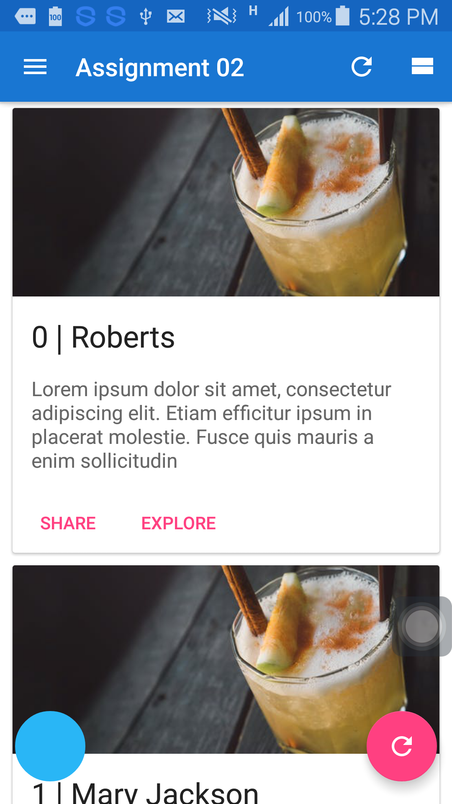
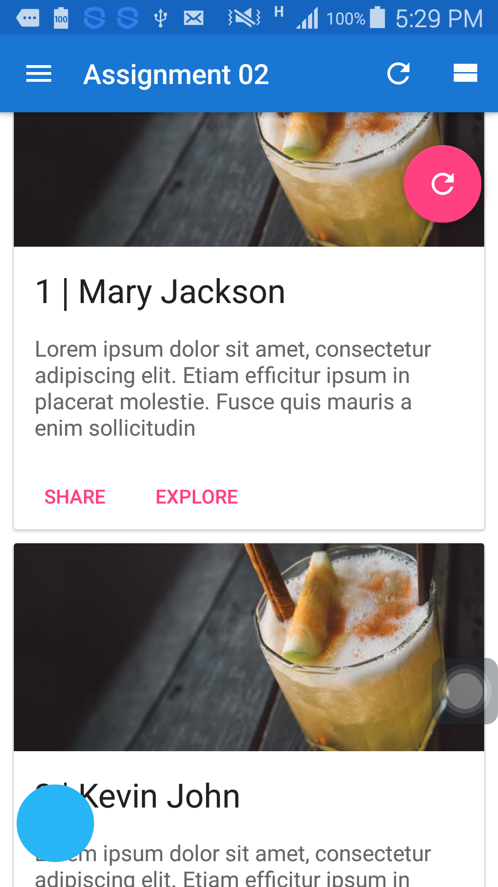
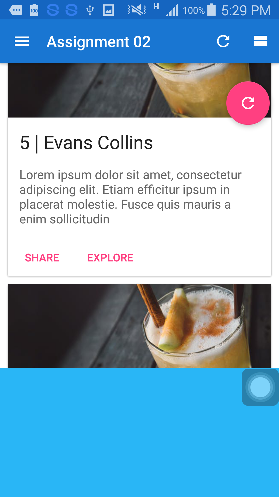

# RecycleView with animation when pass the card
*Ackwoledgement* : This project is an assignment in W3 Engineers Android UI team.

After scroll the animation is working on

## Requirements

- JDK 1.8
- [Android SDK](http://developer.android.com/sdk/index.html).
- Android N [(API 24) ](http://developer.android.com/tools/revisions/platforms.html).
- Latest Android SDK Tools and build tools.

### How to implement

1. Create a project or download it

## Code Quality

This project integrates a combination of unit tests, functional test and code analysis tools.

## Project Screen Short

